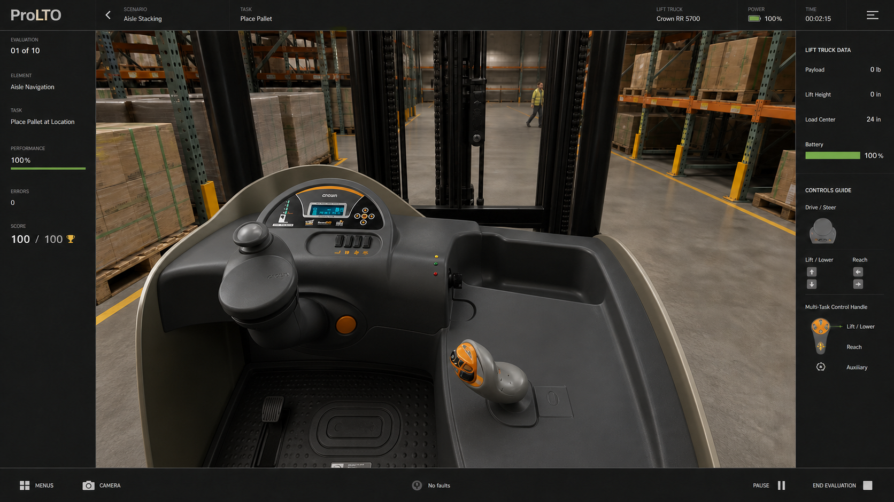
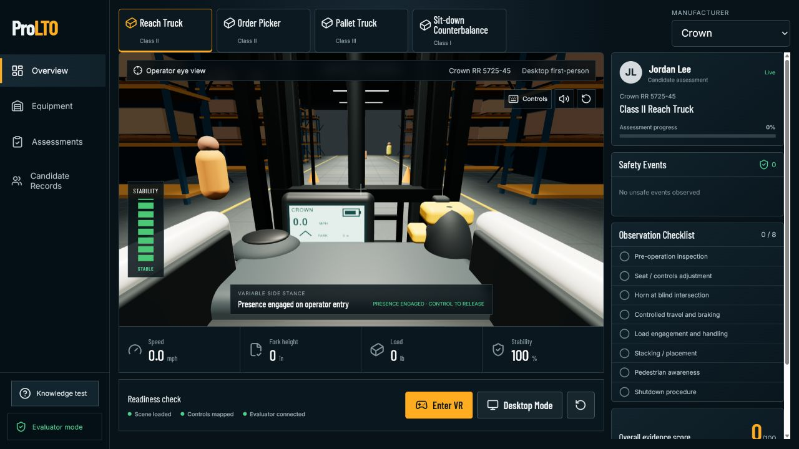

# Crown RR 5725-45 visual fidelity audit

This audit compares the accepted operator-eye fidelity target with the current simulator capture. The target is the visual contract for the Crown reach-truck benchmark.

| Fidelity point | Accepted target | Current implementation | Result |
| --- | --- | --- | --- |
| Operator position | Standing, variable side stance with a clear view of both hand controls and the mast | Standing eye point with presence pedal behavior and direct first-person controls | Pass for posture and perspective |
| Control arrangement | Left palm steering tiller, integrated display, right Multi-Task Control Handle, separate foot controls | All primary controls are separately modeled, raycastable, and animated in those positions | Pass for layout, needs production mesh detail |
| Mast and reach mechanics | Fixed nested mast, visible chains, hydraulic cylinder, moving fork carriage and pantograph | Fixed rails, nested channels, cylinder, chains, load backrest, standard forks, and carriage-only reach motion are present | Pass for mechanical structure |
| Equipment proportions | Model-specific Crown RR 5700 family dimensions | RR 5725-45 36V envelope uses the 58.04 inch head length, 9.4 inch floor height, 42 inch outer straddle baseline, and 36 x 4 x 1.75 inch standard forks | Pass for measured baseline |
| Surface fidelity | Molded grained plastics, coated steel, rubber, labels, hardware, and realistic wear | PBR paint, metal, plastic, rubber, emissive display, and rounded geometry are present, but scan-quality grain, decals, fasteners, seams, and wear maps are incomplete | Does not yet pass photoreal target |
| Warehouse rendering | Photographic concrete, racks, wrapped loads, overhead lighting, and realistic shadows | Procedural concrete texture, detailed pallets and wrap, ceiling fixtures, ACES tone mapping, and PBR lighting are present | Improved, not yet photographic |
| Rated motion | Direction, load, lift, lower, and tilt behavior follows the selected truck | Empty and loaded speed limits by travel direction, lift and lower rates, and 3 degree forward plus 4 degree rear tilt limits use Crown RR 5725-45 published values | Pass for published ratings |
| Full digital-twin accuracy | Exact control travel, steering calibration, reach speed, attachment behavior, materials, sounds, and every production option | Public photos, brochures, specifications, and video now provide the continuing reconstruction baseline. Exact detent forces, steering maps, sound recordings, and option-specific dimensions remain provisional | Active public-reference reconstruction, not manufacturer-validated |

## Reference and evidence

| Accepted fidelity target | Current browser capture |
| --- | --- |
|  |  |

## Acceptance decision

The current build is a materially more accurate simulator baseline, but it is not an exact or manufacturer-approved digital twin. Development will continue with the traceable public-reference process documented in `web-reference-modeling.md`. If measured CAD, a physical truck, or manufacturer data becomes available later, it can refine the same meshes and response profiles without blocking the present fleet build.
